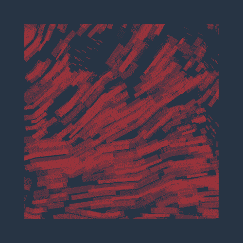

# Genuary 2022 🦀

This repository is a collection of daily sketches made during the [genuary](https://genuary.art/) event in january 2022.

> GENUARY is an artificially generated month of time where we build code that makes beautiful things.

This year I decided to use the [Nannou](https://nannou.cc) framework using Rust which was really fun! 🦀

You can click on any gif below to see the source file, enjoy!

## Setup

To setup the project you need to install [Rust](https://www.rust-lang.org/learn/get-started) and clone the project:

```bash
$ git clone https://github.com/johhnry/genuary-2022
$ cd genuary-2022
$ cargo run --bin day_x
```

(`day_x` is the number of the sketch in the cargo workspace)

## 2022 edition

| [](./src/day_1/src/main.rs)<br><center>Draw 10,000 of something.</center> | [](./src/day_2/src/main.rs)<br/><center>Dithering.</center> | [](./src/day_3/src/main.rs)<br/><center>Space.</center> |
| ------------------------------------------------------------ | ------------------------------------------------------------ | ------------------------------------------------------------ |
| [](./src/day_4/src/main.rs)<br/><center>The next next Fidenza.</center> |                                                              |                                                              |
|                                                              |                                                              |                                                              |
|                                                              |                                                              |                                                              |
|                                                              |                                                              |                                                              |
|                                                              |                                                              |                                                              |
|                                                              |                                                              |                                                              |
|                                                              |                                                              |                                                              |
|                                                              |                                                              |                                                              |
|                                                              |                                                              |                                                              |
|                                                              |                                                              |                                                              |
|                                                              |                                                              |                                                              |

## Links

- [genuary 2022 home page](https://genuary.art)

- [Nannou](https://nannou.cc/) a creative coding library in Rust

## License

[MIT](https://choosealicense.com/licenses/mit/)
